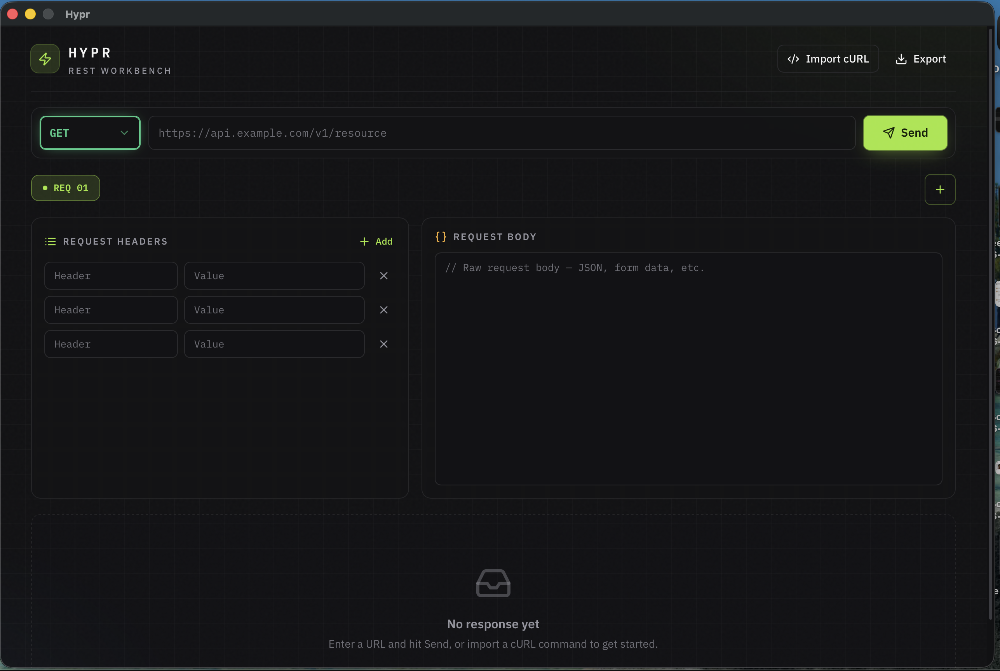

<div align="center">

# Hypr

**A fast, cross-platform desktop REST API client — a lightweight Postman / Insomnia alternative.**

Build, send, and inspect HTTP requests from a native desktop app powered by a Go engine and a React UI.

[](https://github.com/dropdevrahul/hypr/actions/workflows/ci.yml)
[](https://github.com/dropdevrahul/hypr/releases)
[](LICENSE)
[](go.mod)




</div>

## Features

- ⚡ **Native & fast** — a single self-contained binary; the HTTP engine runs in Go, not a bundled browser runtime.
- 🗂️ **Tabbed requests** — work on multiple requests side by side.
- 🧩 **Header editor** — manage request headers as simple key/value pairs.
- 📥 **Import from cURL** — paste a `curl` command and it's parsed, populated, and run instantly.
- 🎨 **Syntax-highlighted responses** — pretty-printed JSON bodies and response headers.
- 💾 **Export** — save a request and its response to JSON via a native file dialog.
- 🖥️ **Cross-platform** — macOS, Windows, and Linux.

## Download

Grab the latest build for your platform from the [**Releases**](https://github.com/dropdevrahul/hypr/releases/latest) page:

| Platform | Asset |
|----------|-------|
| macOS (universal) | `hypr-macos-universal.zip` |
| Windows (x64) | `hypr-windows-amd64.zip` |
| Linux (x64) | `hypr-linux-amd64.tar.gz` |

> [!NOTE]
> macOS builds are ad-hoc signed. On first launch you may need to right-click → **Open**, or run
> `xattr -dr com.apple.quarantine /Applications/hypr.app`.

## Build from source

### Prerequisites

- [Go](https://go.dev/dl/) 1.22+
- [Node.js](https://nodejs.org/) 18+
- [Wails CLI](https://wails.io/docs/gettingstarted/installation/) v2 — `go install github.com/wailsapp/wails/v2/cmd/wails@latest`

Run `wails doctor` to verify your toolchain and platform dependencies.

### Develop

```bash
wails dev
```

Live development with Vite HMR for the frontend. A browser dev server is also available at
`http://localhost:34115` where you can call the Go methods from devtools. (Go changes require a restart.)

### Build a production binary

```bash
wails build
```

Produces a native executable in `build/bin/`.

## Usage

1. Pick a **method**, enter a **URL**, and hit **Send** (or press <kbd>Enter</kbd> in the URL field).
2. Add **request headers** as key/value rows and write a **request body**.
3. Use the **+** tab button to keep multiple requests open at once.
4. Click **Import cURL** to paste a `curl` command — it fills the current tab and runs immediately.
5. Click **Export** to save the request/response as JSON.

## Tech stack

| Layer | Tech |
|-------|------|
| Shell | [Wails v2](https://wails.io) (native webview, no Electron) |
| Backend | Go — `net/http` client, cURL parser |
| Frontend | React + TypeScript, Vite |
| UI | Tailwind CSS + [shadcn/ui](https://ui.shadcn.com) (Radix), lucide-react, IBM Plex |

See [CLAUDE.md](CLAUDE.md) for an architecture overview.

## Contributing

Contributions are welcome! Please read [CONTRIBUTING.md](CONTRIBUTING.md) and the
[Code of Conduct](CODE_OF_CONDUCT.md) before opening an issue or pull request.

Run the test suite with:

```bash
go test ./...                 # backend
cd frontend && npm run build  # frontend typecheck + build
```

## Releases

Hypr follows [Semantic Versioning](https://semver.org). See [CHANGELOG.md](CHANGELOG.md) for release history
and the [release process](CONTRIBUTING.md#releasing) for how versions are cut.

## License

[MIT](LICENSE) © Rahul Tyagi
